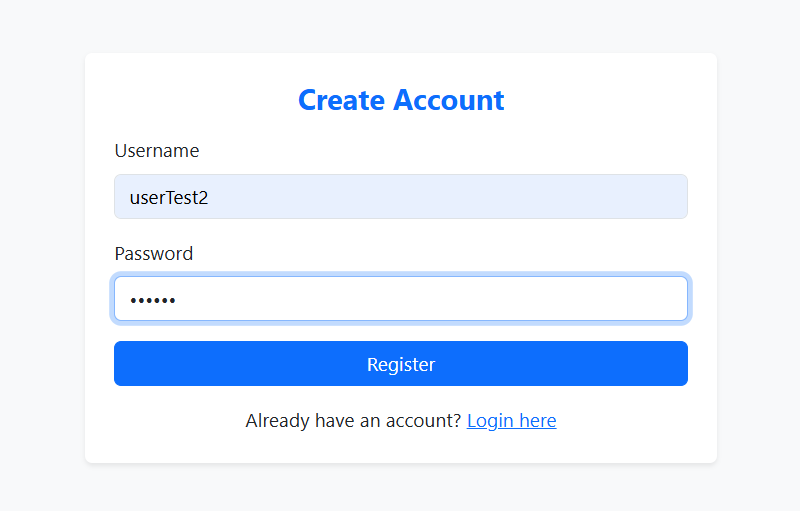
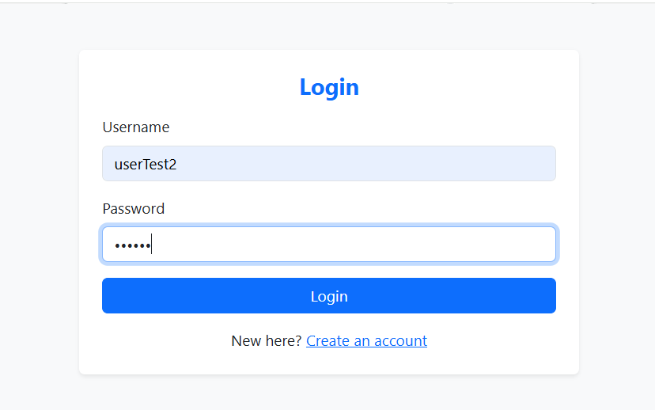
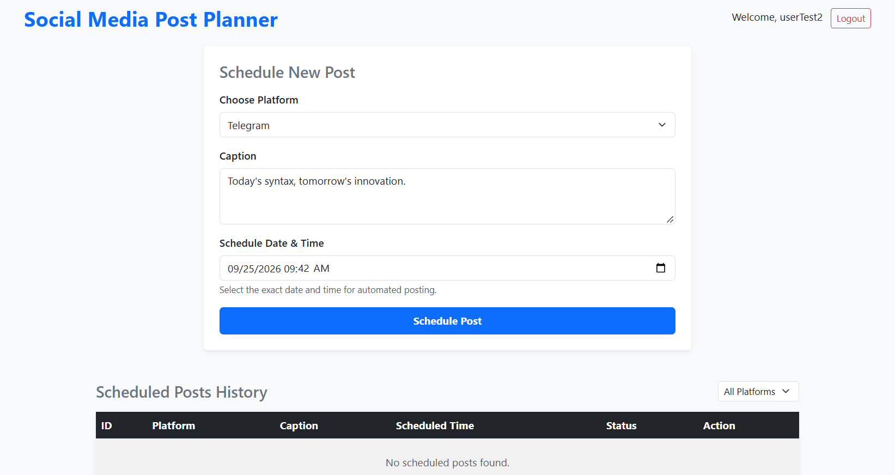
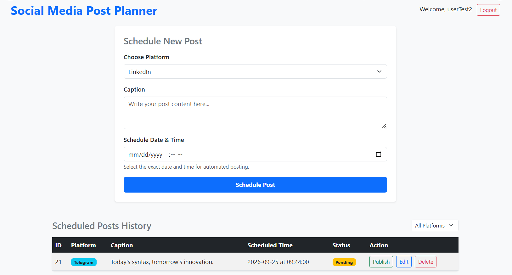
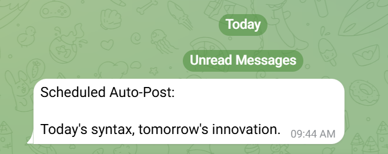
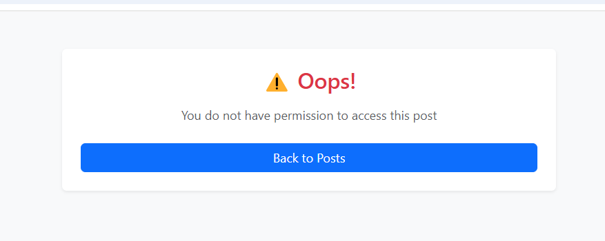

# 🚀 Social Media Planner

A full-stack Spring Boot application to schedule, manage, and automatically publish social media posts — featuring user authentication, post ownership enforcement, a background scheduler, and live publishing via the Telegram Bot API.

🔗 **Live demo:** https://social-media-planner-production-49ad.up.railway.app

---

## Features

- **User authentication** — Spring Security form-based login with BCrypt password hashing; every user has their own account
- **Post ownership enforcement** — users can only view, edit, delete, or publish their own posts; attempting to access another user's post is blocked server-side and handled gracefully, not just hidden in the UI
- **Automated scheduling** — a background `@Scheduled` job checks every 30 seconds for posts whose scheduled time has arrived and publishes them automatically, with no manual trigger needed
- **Live Telegram publishing** — posts scheduled for the Telegram platform are actually sent via the Telegram Bot API when their time arrives
- **Multi-platform support** — posts can be tagged for LinkedIn, Twitter, Instagram, Telegram, or Facebook; Telegram is fully wired to a live publishing integration, while the other platforms are supported in the UI and data model for future extension (their APIs require paid access or business account verification not pursued in this project's scope)
- **Input validation** — request-level validation on registration (`@NotBlank`, `@Size`) with clean, field-level error messages
- **Centralized exception handling** — a global `@ControllerAdvice` catches ownership violations and invalid requests, rendering a friendly error page instead of a stack trace
- **Externalized secrets** — database credentials and the Telegram bot token are environment-based, never hardcoded
- **Platform filtering & pagination** — view posts by platform, with a paginated post history

## Tech Stack

| Layer | Technology |
|---|---|
| Language | Java 21 |
| Framework | Spring Boot 4.1.1 |
| Security | Spring Security (form login), BCrypt |
| Persistence | Spring Data JPA + Hibernate |
| Database | PostgreSQL (Railway-hosted) |
| Frontend | Thymeleaf, Bootstrap 5 |
| Integration | Telegram Bot API |
| Deployment | Railway (Docker-based) |
| Build | Maven |

## How It Works

1. A user registers and logs in — every post they create is tied to their account via an `owner` relationship on the `Post` entity
2. When scheduling a post, they pick a platform, write a caption, and choose a future date/time
3. A background scheduler (`PostScheduler`) runs every 30 seconds, checking the database for posts marked `Pending` whose scheduled time has passed
4. For posts tagged **Telegram**, the scheduler calls `SocialMediaService.publishPost()`, which sends the caption to the configured Telegram chat via the Bot API. On success, the post's status updates to `Published`
5. Users can also publish a post manually, edit it, or delete it — but only if they own it; ownership is checked server-side on every action, not just hidden via the UI

## Architecture Overview

User → Spring Security (form login) → PostController
↓
Ownership Check
↓
GlobalExceptionHandler (on violation)
↓
PostRepository
↑
PostScheduler (every 30s) → SocialMediaService → Telegram Bot API


- `SecurityConfig` enforces that every route except `/register` and `/login` requires authentication
- `CustomUserDetailsService` loads user credentials from the database for Spring Security to validate on login
- `PostController` resolves the logged-in user from the `Authentication` object and checks post ownership before any edit, delete, or publish action
- `PostScheduler` runs independently of user requests, polling the database and triggering real publishing for due posts
- `GlobalExceptionHandler` intercepts ownership violations (`SecurityException`) and invalid requests, rendering a clean error page

## Security Design Notes

- **Passwords are never stored in plain text** — BCrypt hashing via Spring Security's `PasswordEncoder`
- **Post ownership is enforced server-side, not just hidden in the UI.** Every edit/delete/publish action checks that the logged-in user is the post's owner before proceeding, regardless of what URL is requested directly
- **Secrets are environment-based.** Database credentials (`DB_URL`, `DB_USERNAME`, `DB_PASSWORD`) and the Telegram bot token (`TELEGRAM_BOT_TOKEN`, `TELEGRAM_CHAT_ID`) are injected via environment variables — locally via a git-ignored `application-local.properties`, and in production via Railway's environment variable settings
- **A leaked secret was detected and rotated.** During development, a Telegram bot token was briefly exposed in git history via GitHub's secret scanning. It was immediately revoked through BotFather and reissued once identified, and `.gitignore` rules were tightened to prevent recurrence — a practical lesson in why rotating a leaked credential matters more than just removing it from the latest commit

## Running Locally

1. Clone the repo:
```bash
   git clone https://github.com/tarini-codes/social-media-planner.git
```
2. Create `src/main/resources/application-local.properties`:
```properties
   DB_URL=jdbc:postgresql://localhost:5432/your_db_name
   DB_USERNAME=your_db_username
   DB_PASSWORD=your_db_password
   TELEGRAM_BOT_TOKEN=your_telegram_bot_token
   TELEGRAM_CHAT_ID=your_telegram_chat_id
```
3. Run with the `local` profile active:
```bash
   ./mvnw spring-boot:run -Dspring-boot.run.profiles=local
```
4. Visit `http://localhost:8081/register` to create an account, then log in and start scheduling posts.

## What This Project Demonstrates

This started as a simple CRUD app for scheduling posts and was extended into a multi-user system with real authentication, ownership-based access control, and genuine automation — the scheduler doesn't just mark posts as "done," it actually publishes them to Telegram in real time. Each stage (auth → ownership enforcement → exception handling → secrets management → scheduler verification) was built and tested independently, both locally and in a live Railway deployment, including a real incident where a leaked credential was caught and rotated.

## Screenshots

### Authentication



### Post Management



### Live Telegram Publishing


### Ownership Protection
